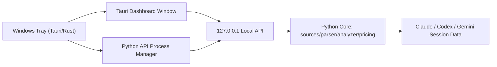

# Windows Tray MVP Design

## Summary

Build a Windows desktop tray MVP that provides the same class of statistics and tray experience as the existing macOS app, without rewriting the macOS Swift app and without duplicating parser or analyzer logic.

The Windows app will be a Tauri shell that launches and monitors the Python local API, exposes a system tray entry point, opens the existing dashboard experience, and reserves clear extension points for Windows notifications, launch-at-login, and hotkeys.

## Goals

- Provide a Windows system tray app for `cc-statistics`.
- Reuse the Python statistics core and local API as the product kernel.
- Preserve the existing macOS Swift app unless a small shared abstraction change is required.
- Avoid duplicating parser, analyzer, pricing, source discovery, or source filtering logic in the Windows shell.
- Keep the first release small enough to test and ship incrementally.

## Non-Goals

- Do not rewrite the existing macOS Swift UI.
- Do not modify macOS Swift code except for narrowly required shared abstraction changes.
- Do not implement a complete Windows-native statistics panel in the first version.
- Do not duplicate the Swift parser/analyzer implementation in Rust, TypeScript, or JavaScript.
- Do not build a Windows version of the iOS bridge or approval flow in this phase.
- Do not implement signing, automatic updates, or installer polish in the MVP unless the packaging path requires minimal package metadata.

## Recommended Approach

Use Tauri for the Windows desktop shell.

Tauri is the best fit because it gives the Windows side native tray/window/process integration with a smaller footprint than Electron, while still allowing the app to reuse the existing Web dashboard and Python local API. The desktop shell should be treated as a platform adapter, not as a statistics engine.

## Architecture



The Python core remains responsible for:

- Source discovery and filtering.
- Session parsing.
- Token and cost analysis.
- Web/API response shapes.

The Tauri shell is responsible for:

- Tray icon and menu.
- Dashboard window lifecycle.
- Starting, monitoring, and stopping the Python local API.
- Displaying Windows toast notifications for shell-level status.
- Providing platform hooks for launch-at-login and hotkeys.

## Directory Layout

Create a new desktop app directory:

```text
desktop/cc-stats-tauri/
  package.json
  src/
    main.ts
    apiClient.ts
    dashboard.ts
  src-tauri/
    Cargo.toml
    tauri.conf.json
    src/
      main.rs
      api_process.rs
      tray.rs
      window.rs
      health.rs
```

The exact Tauri scaffold may vary slightly depending on the Tauri version, but the responsibilities should remain stable:

- `api_process.rs`: build and supervise the Python API process.
- `tray.rs`: tray menu and tray events.
- `window.rs`: dashboard window creation and focus.
- `health.rs`: local API health checks and retry state.
- `apiClient.ts`: small frontend helper for calling the local API.
- `dashboard.ts`: dashboard URL construction and UI glue.

## Process Model

On startup, the Tauri app should:

1. Find a Python executable.
2. Start the local API using `python -m cc_stats_web` or a dedicated future API command if one is added.
3. Parse the printed local URL or use a structured startup mode introduced in Python.
4. Poll a health endpoint or a known API endpoint until the server is available.
5. Enable tray actions once the API is healthy.

On shutdown, the Tauri app should:

1. Stop the Python child process it started.
2. Close the dashboard window.
3. Leave no background API process behind.

If the API fails:

- The tray menu should expose `Restart API`.
- The dashboard window should show an error state or open only after restart.
- A Windows toast can report startup failure or recovery.

## API Contract

The Windows shell should consume the same API surface the Web dashboard already uses:

- `GET /api/projects?source=...`
- `GET /api/stats?project=...&days=...&source=...`
- `GET /api/daily_stats?project=...&days=...&source=...`
- `GET /api/skills?project=...&days=...&source=...`
- `GET /api/version_check`

The shell should not parse session files directly.

For process startup, the MVP can start `python -m cc_stats_web` and parse the printed URL. If this becomes brittle during implementation, add a small Python helper that starts the server and prints one JSON startup line with the selected port. That helper belongs in Python, not in the Tauri app.

## User Experience

Tray menu MVP:

- `Open Dashboard`
- `Restart API`
- `Quit`

Dashboard MVP:

- Opens the existing dashboard experience.
- Preserves source filtering for Claude, Codex, and Gemini.
- Supports Codex statistics on Windows through the Python source registry.

Notification MVP:

- Show a Windows toast when API startup fails.
- Show a Windows toast when an API restart succeeds after failure.

Hotkeys and launch-at-login:

- Keep implementation hooks in the design, but treat them as follow-up tasks unless Tauri support is straightforward and low-risk during MVP implementation.

## macOS Constraint

The existing macOS Swift app remains the macOS implementation.

The Windows Tauri shell should not modify Swift UI, Swift parsers, or macOS-specific behavior. If a shared Python abstraction must change for Windows, make the change in Python and keep it compatible with the macOS app. macOS Swift code should be changed only when a narrowly scoped shared contract requires it.

## Testing Strategy

Python:

- Continue running the full Python test suite.
- Add tests only when new Python startup helpers or API contracts are introduced.

Rust/Tauri:

- Unit test command construction, URL parsing, health state transitions, and process state where possible.
- Keep process-manager code small and testable without launching the real dashboard for every test.

End-to-end smoke:

- Start the Windows shell or its API process manager.
- Confirm the Python API starts on `127.0.0.1`.
- Request `/api/projects?source=codex`.
- Open the dashboard window URL.
- Quit the app and confirm the API child process stops.

## Risks

- Python executable discovery can vary across Windows environments.
- Packaging Python with Tauri may be more involved than launching an installed Python environment.
- Tauri tray, notifications, and launch-at-login behavior can differ across Windows versions.
- Reusing the static Web dashboard may need small URL/base-path adjustments.

## Success Criteria

- A Windows user can launch the desktop app and see a tray icon.
- `Open Dashboard` shows the statistics dashboard.
- The dashboard can show Codex projects and stats through the Python API.
- `Restart API` recovers from a stopped or failed API process.
- `Quit` shuts down the app and any API process it started.
- The full Python test suite still passes.
- No macOS Swift UI rewrite occurs.

## Follow-Up Candidates

- Launch-at-login.
- Global hotkey.
- Richer Windows notifications.
- Installer and code signing.
- Native Windows settings panel.
- Python bundling strategy for users without Python installed.
